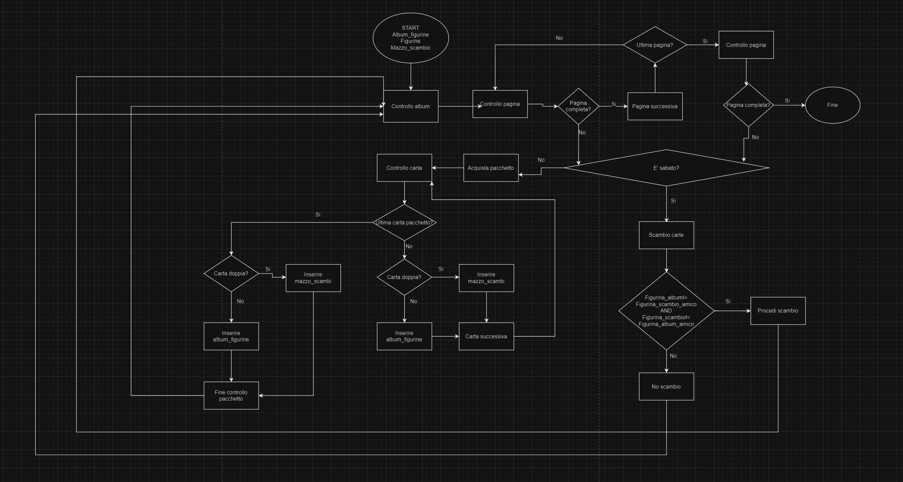

# Esercizio

Che emozione, ogni volta che apro un pacchetto nuovo... chissà se troverò quella figurina così rara!
Dopo averle sfilate dal pacchetto, me le passo tra le mani controllando nell’album: attacco subito quelle nuove, mentre le doppie le metto in un mazzetto a parte. Ormai ne sto accumulando diverse, spero di riuscire a combinare diversi scambi sabato con i miei amici!

---

## Algoritmo

---

1. **Controllo album:** Il primo step da compiere è quello di controllare se l'album sia completo o meno. Per poter capire se l'album sia completo o meno bisogna controllare tutte le pagine al suo interno

- **Controllo pagina:** il processo di controllo pagina segue alcuni step, inanzitutto controlliamo se la pagina corrente sia completa o meno, qualora fosse incompleta possiamo terminare il processo di controllo album. Se invece la pagina corrente risulta completa si passa alla pagina successiva, prima del controllo pagina però bisogna interrogarsi se sia o meno l'ultima pagina in quanto qualora fosse l'ultima pagina e fosse completa, l'album risulterebbe completo e quindi il nostro controllo sarebbe terminato. Il processo continua quindi fin quando non incontriamo una pagina incompleta, oppure anche l'ultima pagina risulti completa.

2. **Giornata scambi o no?:** se l'album risulta incompleto, ci interrogheremo se sia o meno la giornata prefissata per gli scambi con i nostri amici.

- Se è giorno di scambi. Possiamo fare un controllo con i nostri amici, il controllo prevede che due condizioni siano vere allo stesso tempo, ossia, le carte del nostro amico non devono essere presenti nel nostro album e le nostre carte degli scambi non devono essere presenti nell'album dell'amico. Questo controllo lo implementiamo con l'Operatore Logico AND. Se il controllo va a buon fine quindi tutte e due le condizioni sono vere si procederà allo scambio in caso contrario non verrà effettuato alcuno scambio. In entrambi i casi si procede nuovamente con il controllo dell'album.
- Se invece non è giorno di scambi procediamo all'acquisto dei pacchetti di figurine.

3. **Acquisto pacchetto:** una volta acquistato e aperto il pacchetto procediamo con il controllo delle singole carte.

- Per prima cosa bisogna chiedersi se la carta che stiamo controllando sia l'ultima del pacchetto o meno.
  -Se non lo è contolleremo se questa carta sia doppione o meno, se è doppione l'aggiungiamo al mazzo doppioni, se non è doppione l'andremo ad attaccare nel nostro album. Per poi proseguire con il controllo delle carte appena acquistate, il controllo dura fino a quando non arriviamo all'ultima figurina del pacchetto.
  -Il processo per l'ultima carta del pacchetto è identico a quello delle altre carte, con la differenza che, una volta stabilito se la figurina andrà attaccata nell'album o inserita nel mazzo dei doppioni, si procedera ancora una volta con il controllo dell'album.

Il processo durerà in loop fino a quando dal controllo album non risulterà che quest'ultimo sia completo.

---

##Anteprima

---
